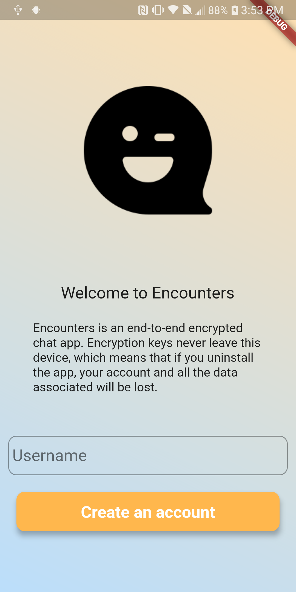
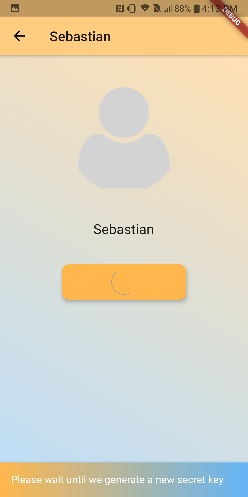
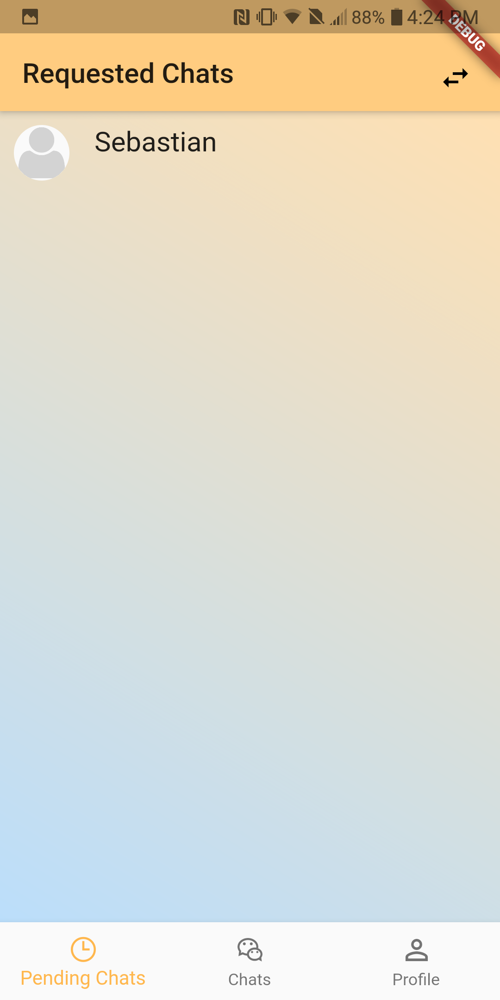
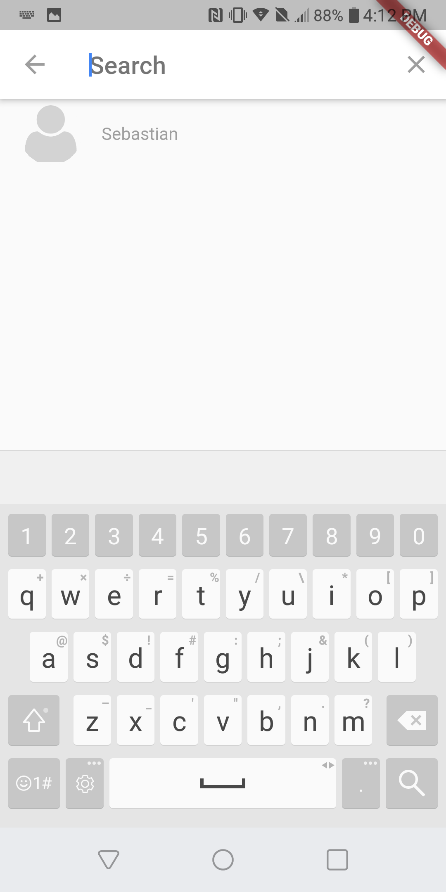
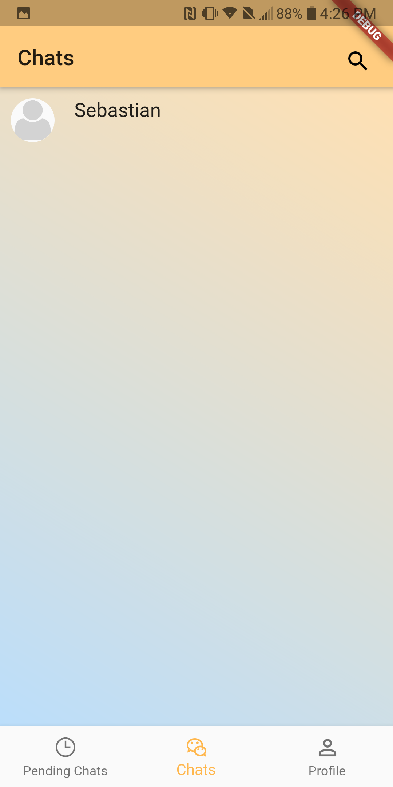
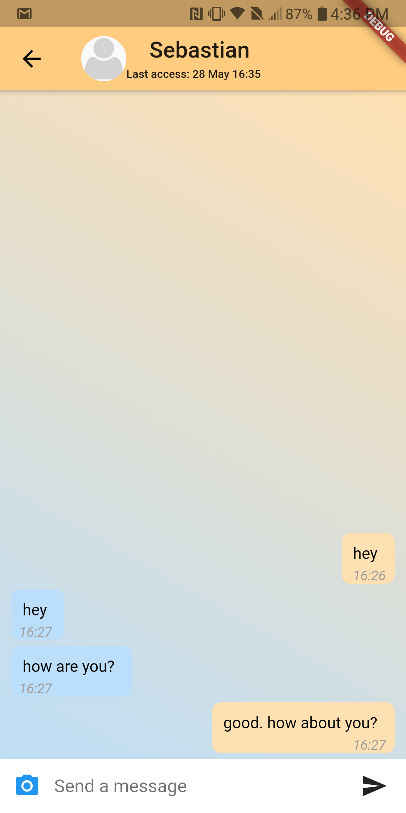
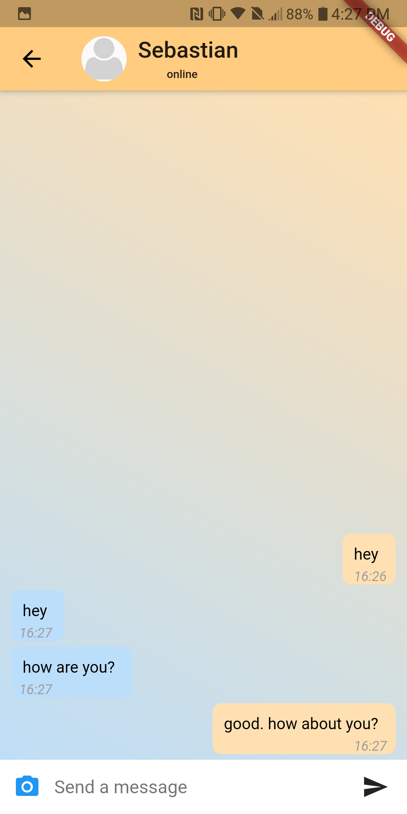

# Encounters

Encounters is a end to end chatting app using SHA-256 keys to encrypt messages. After a user creates an account, he or she can search for other users and send and accept chat requests; once both parties agree to chat, then the two users can start chatting.
Every time that a user sends a request or accepts one a new pair of key are created, this may take few seconds
depending on the device, but it's important that the user doesn't close the app (there is a pop up message notifying the user,
there sure is a better way but it's wasn't that important for the scope of my project). 

## Important
If you notice there is no sign out. This is because, private keys never leave the user's device. If the user deletes the app the encryption keys are lost and the account unable. 

## Getting Started

This project is a starting point for a Flutter application.

A few resources to get you started if this is your first Flutter project:

- [Lab: Write your first Flutter app](https://flutter.dev/docs/get-started/codelab)
- [Cookbook: Useful Flutter samples](https://flutter.dev/docs/cookbook)

For help getting started with Flutter, view our
[online documentation](https://flutter.dev/docs), which offers tutorials,
samples, guidance on mobile development, and a full API reference.

## Suggestions

After you create a flutter project copy the ymal file and run flutter pub get.
Then you can copy the lib folder

NOTE: you need to configure you Firebase project adn Firebase Cloud Functions in order to use the app correctly

The app supports different laguages.
To add a new language look at the Language folder, add your dart file with the new laguage and add it to the Language.dart file.
Then, change the laguage code in the GlobalVariables.dart

## Screenshots

